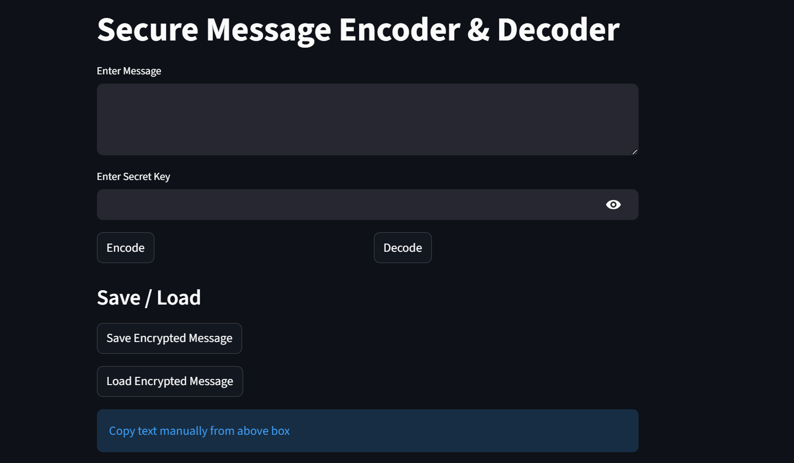
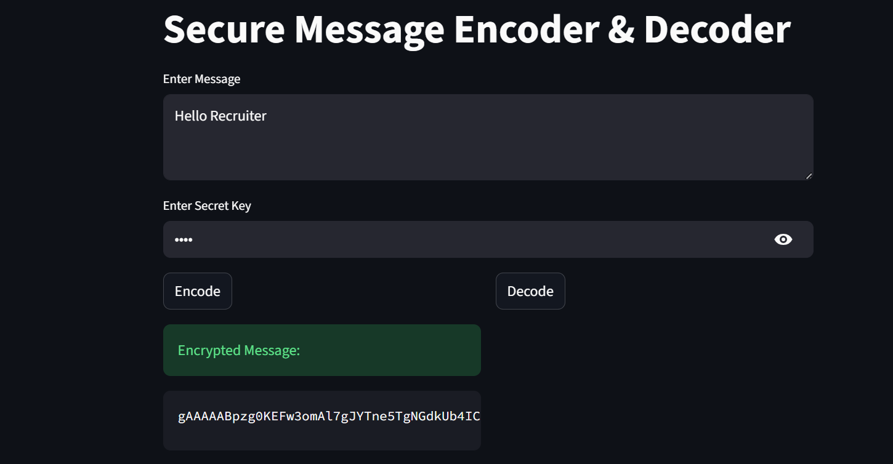
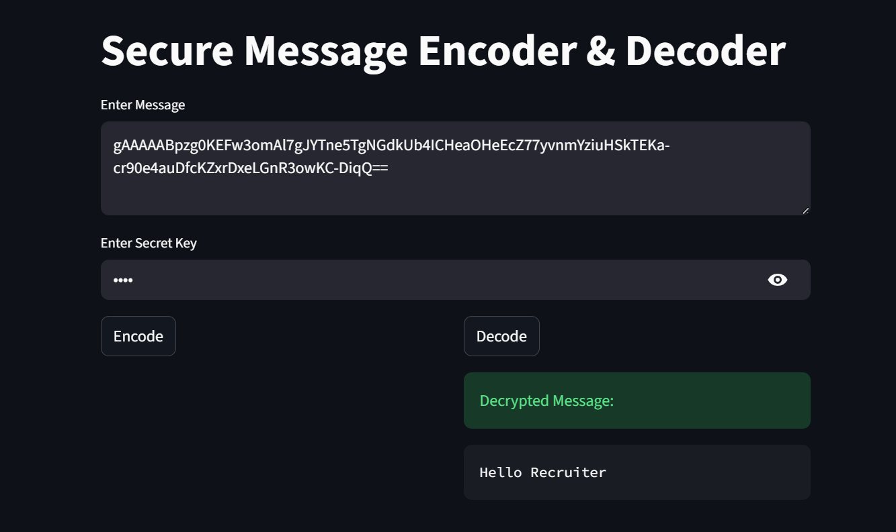

#  Secure Message Encryption App

##  Overview

A secure message encryption and decryption system built using Python. The application supports both a desktop GUI (Tkinter) and a web interface (Streamlit), allowing users to safely encode and decode messages using password-based encryption.

---

##  Features

*  AES-based encryption (Fernet)
*  Password-based key generation (SHA-256)
*  Desktop GUI using Tkinter
*  Web app using Streamlit
*  Save and load encrypted messages
*  Copy to clipboard
*  Error handling for invalid keys

---

##  Tech Stack

* Python
* Cryptography (Fernet)
* Tkinter
* Streamlit

---

##  Project Structure

secure_message_app/

│── app.py

│── ui.py

│── crypto_utils.py

│── streamlit_app.py

│── requirements.txt

---

##  How to Run

### 1. Clone repo

git clone https://github.com/nitinsukthe/secure-message-app/tree/main

cd secure_message_app

### 2. Create virtual environment

python -m venv venv
venv\Scripts\activate

### 3. Install dependencies

pip install -r requirements.txt

### 4. Run Desktop App

python app.py

### 5. Run Web App

streamlit run streamlit_app.py

---

##  Example Usage

* Enter message and secret key
* Click Encode to encrypt
* Save encrypted message
* Load and decode using same key

---

##  Future Improvements

* User authentication system
* Database integration
* Encrypted chat system
* Cloud deployment

---

##  Screenshots

###  Web App Interface

###  Encrypted Message

###  Save Encrypted Message

###  Load Encrypted Message

###  Decrypted Message

---

##  Author

SUKTHE NITIN
